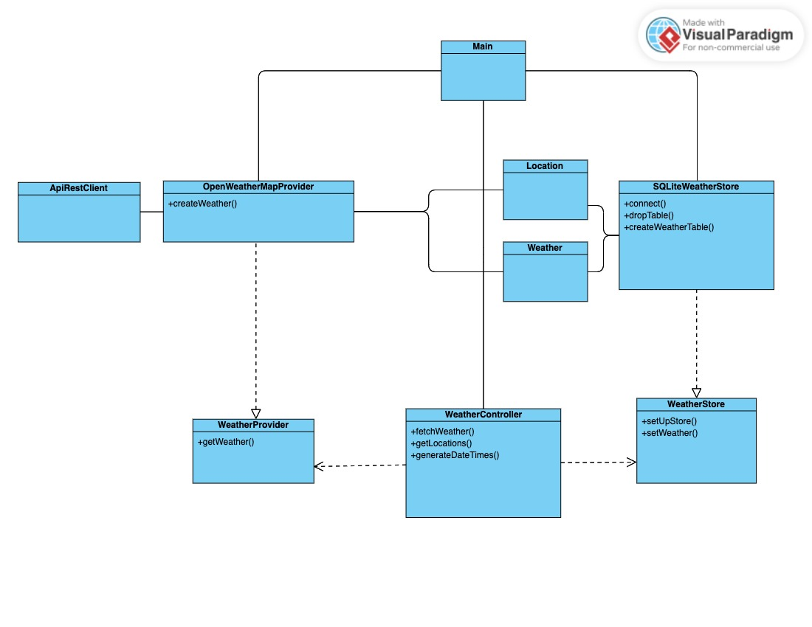

# Weather Prediction Project

## Cover Page
- **Title:** Weather Query Application
- **Subject:** Development of Application for Data Science
- **Course:** 4
- **Degree:** Bachelor in Science and Engineering of Data
- **School:** School of Computer Science
- **University:** University Las Palmas de Gran Canaria

## Functionality Summary
This project entails a Java application that periodically queries the meteorological service API to retrieve the weather forecast for the 8 Canarian islands over the next 5 days at 12 PM daily. The acquired data is stored in an SQLite database, with a dedicated table for each island and an entry for each day. Persisted information includes temperature, precipitation probability, humidity, cloud cover, and wind speed.

## Resources Used
- **Development Environment:** IntelliJ IDEA
- **Version Control Tools:** Git
- **Repository Platform:** GitHub
- **Documentation Tools:** Markdown plugin

## Prerequisites
- **Java Version:** Java 17 or higher is required to run this application.

## Execution Arguments
When running the application, the following arguments are required:
1. `apiKey`: API access token.
2. `apiURL`: URL of the meteorological service's API.
3. `csvFilePath`: File path to the CSV file containing the geographical locations, separated with ";".
    
   Each line should contain the name of the island ";" longitude ";" latitude
4. `dbPath`: File path to the SQLite database for storing weather data.
5. `hoursFrequency`: The frequency of the query (in hours, an integer with one decimal).
   
Examples:
- 1.0 This is one hour
- 2.5 This is two hours and a half
- 0.1 This is six minutes

Note: All paths should include the name of the file and its extension.
## Usage Instructions
1. Clone the repository from GitHub.
2. Open the project in IntelliJ IDEA.
3. Configure the desired geographical coordinates for weather queries.
4. Build the project to generate a JAR file.
5. Open a terminal or command prompt.
6. Navigate to the directory containing the generated JAR file.
7. Execute the .jar sending the execution parameters explained before:

```bash
java -jar practice1.jar apiKey apiURL csvFilePath dbPath hoursFrequency
```

## Design
### Design Patterns and Principles
In the development of this application, various design patterns and principles were employed to enhance the structure, maintainability, and extensibility of the codebase.

#### MVC (Model-View-Controller) Architecture
The application follows the MVC architectural pattern, where:
- **Model:** Represents the data and business logic (e.g., data retrieval).
- **View:** Displays the user interface and presents information. However for this project there is not an implemented view since user messages and outputs are displayed through the console.
- **Controller:** Manages the flow of data between the Model and View, handling user inputs and system events.

#### SOLID Principles
The SOLID principles are a set of object-oriented design principles that aim to create scalable and maintainable software. Here's a brief overview:

- **Single Responsibility Principle (SRP):** Each class should have a single responsibility.
- **Open/Closed Principle (OCP):** Software entities should be open for extension but closed for modification.
- **Liskov Substitution Principle (LSP):** Objects of a superclass should be able to be replaced with objects of a subclass without affecting the correctness of the program.
- **Interface Segregation Principle (ISP):** A class should not be forced to implement interfaces it does not use.
- **Dependency Inversion Principle (DIP):** High-level modules should not depend on low-level modules; both should depend on abstractions.

#### Cohesion, Abstraction, Coupling, and Modularity
- **Cohesion:** The code exhibits high cohesion by grouping related functionalities together within classes and modules.
- **Abstraction:** Abstraction is used to model real-world entities and interactions, providing a clear and simplified representation of complex systems.
- **Coupling:** Low coupling is maintained to reduce dependencies between different components, promoting flexibility and ease of maintenance.
- **Modularity:** The code is organized into modular components, allowing for easier testing, debugging, and future enhancements.

### UML Class Diagram


